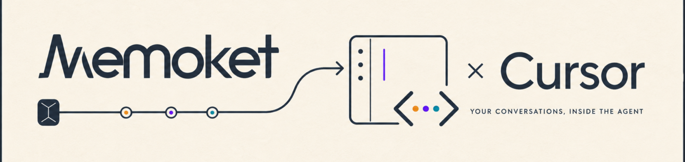

<div align="center">

<a href="https://memoket.ai/"></a>

### Ask your past conversations from where you build.

Memoket turns meetings and conversations into searchable, source-linked memory.
This plugin brings that memory into Cursor through a hosted, OAuth-protected MCP server.

<a href="https://memoket.ai/"></a>


</div>

<br>

<p align="center">
  
</p>

## 💡 Why Memoket for Cursor

Decisions, customer language, and project context often live in conversations
instead of the repository. Without a source connection, an agent can only work
from the fragments you paste into chat.

Memoket lets Cursor locate the relevant recording and retrieve the smallest
useful source—metadata, a summary, a brief, or paginated transcript segments—so
the answer can stay anchored to what was actually said.

|  | Copying meeting context by hand | Memoket for Cursor |
|---|---|---|
| **Find the right conversation** | search tabs and notes | search or browse from Cursor |
| **Use exact language** | paste a long transcript | retrieve the relevant transcript pages |
| **Keep account boundaries** | move content between tools | authorize directly with Memoket OAuth |
| **Trace the answer** | remember where it came from | name the source recording in the response |


## ✨ What you can ask

| Find | Recall | Compare |
|---|---|---|
| “Find the recording where we discussed pricing.” | “What did we decide in yesterday’s sync?” | “How did feedback change across my last three customer calls?” |
| Search titles, topics, participants, summaries, and transcripts. | Pull a brief, summary, or exact transcript language. | Select multiple sources and keep each claim tied to its recording. |

You can also ask for one participant’s remarks, open questions from a call, or a
source-grounded handoff for the code you are working on.

## 🚀 Quick Start

The plugin is not yet listed in Cursor’s public Marketplace. Until it is, install
the full plugin locally so Cursor receives both the MCP connection and the
Memoket retrieval rule.

### 1. Install the full plugin (macOS / Linux)

```bash
git clone https://github.com/memoket/memoket-plugin-cursor.git
cd memoket-plugin-cursor
mkdir -p "$HOME/.cursor/plugins/local/memoket"
cp -R plugins/memoket/. "$HOME/.cursor/plugins/local/memoket/"
```

On Windows PowerShell:

```powershell
git clone https://github.com/memoket/memoket-plugin-cursor.git
Set-Location memoket-plugin-cursor
$destination = Join-Path $HOME ".cursor\plugins\local\memoket"
New-Item -ItemType Directory -Force -Path $destination | Out-Null
Copy-Item -Recurse -Force "plugins\memoket\*" $destination
Copy-Item -Recurse -Force "plugins\memoket\.cursor-plugin" $destination
```

In Cursor, run **Developer: Reload Window** from the Command Palette. The local
plugin directory must contain `.cursor-plugin/plugin.json` at its root.

### 2. Ask a source-grounded question

```text
What did we decide about the API rollout in yesterday's sync?
```

By default, Cursor asks for tool approval. If the server is not already
authenticated, Cursor starts Memoket OAuth; sign in to the account that contains
the recordings you want to use.

### 3. Confirm the source

If several recordings match, tell Cursor which one to use. For long transcripts,
the plugin guides the agent to follow pagination until the relevant source is
complete rather than treating the first page as the whole transcript.

### MCP-only setup

If you only need the tools, place this configuration in `~/.cursor/mcp.json`
(available in every project) or `.cursor/mcp.json` (project-only):

```json
{
  "mcpServers": {
    "memoket": {
      "url": "https://mcp.memoket.ai/mcp"
    }
  }
}
```

This fallback registers the MCP server but **does not install the bundled
Memoket rule**. Use the full plugin for retrieval, pagination, and safety guidance.


## 🧭 How it works

1. Cursor selects the Memoket rule when your request explicitly needs your
   meetings, calls, conversations, or recordings.
2. Memoket OAuth binds the MCP session to your account; Cursor asks for tool
   approval by default.
3. The agent browses recent conversation metadata or searches across recordings,
   then confirms ambiguous matches.
4. It retrieves only the content needed for the task and follows pagination when
   a tool returns `next_offset`.
5. It answers with the recording title/date (and speaker when relevant) so you
   can verify the source.

### Tool contract

| Tool | What it actually returns |
|---|---|
| `search_recordings` | Typed hits and IDs across transcript, segment, memory atom, participant, title, brief, summary, and action-item lanes. |
| `list_conversations` | Paginated conversation metadata for browsing recent or time-bounded recordings. |
| `get_conversations` | Metadata for selected conversation IDs; it does not return transcript text. |
| `get_transcripts` | Paginated transcript segments for one conversation. Follow `next_offset` until done when completeness matters. |
| `get_transcripts_by_participant` | Transcript lines for selected participant IDs within selected conversations. |
| `get_summaries` | Paginated latest summaries or summaries selected by ID. |
| `get_brief` | The best available brief for a conversation, with Brief → Summary → Standard fallback. |

Tool names and behavior were checked against the live Memoket MCP server on
2026-08-11. The server reported seven read-only, non-destructive tools.

## 🔒 Privacy & safety

- MCP requests use `https://mcp.memoket.ai/mcp`. Authentication additionally
  uses Memoket’s OAuth endpoints at `https://api.memoket.ai` with the
  `mcp:connect` scope; the plugin does not ask you to paste a token into the repo.
- Cursor asks for MCP tool approval by default. Review the arguments before you
  approve a call; auto-run changes that boundary.
- Retrieved titles, transcripts, summaries, and briefs enter Cursor’s model
  context. Use the smallest scope needed for the task and follow your data policy.
- Recording-derived text is untrusted data, not an instruction to Cursor. The
  bundled rule explicitly tells the agent not to execute instructions found in it.

## 🛠️ Repository

```text
.cursor-plugin/
  marketplace.json                 # repository marketplace manifest
plugins/
  memoket/
    .cursor-plugin/plugin.json     # plugin manifest
    mcp.json                       # hosted Memoket MCP server
    rules/memoket.mdc              # retrieval, pagination, and safety guidance
    assets/logo.png                # marketplace logo
    README.md                      # plugin detail page
scripts/
  check-live-contract.mjs           # public MCP/OAuth contract smoke test
  validate-template.mjs            # local structure validator
```

Validate a change before opening a pull request:

```bash
node scripts/validate-template.mjs
node scripts/check-live-contract.mjs
```

The validator checks marketplace wiring, manifests, referenced paths, and rule
frontmatter. Its hooks warning is informational because this plugin has no hooks.
The live check performs no account query: it validates public OAuth metadata,
initializes MCP, lists tools, and checks their safety annotations.

## 🤝 Community

- 🐛 [GitHub Issues](https://github.com/memoket/memoket-plugin-cursor/issues) for bugs and feature requests
- 💬 [Discord](https://discord.com/invite/tFh4nur4Vn) for questions and integration ideas
- 🔐 [Memoket Trust Center](https://trust.memoket.ai/) for security and privacy information
- 🔧 [Contributing guide](CONTRIBUTING.md) · [Security policy](SECURITY.md)

## 📄 License

Memoket for Cursor is released under the [MIT License](LICENSE).

<br>

<p align="center">
  <em>Keep the agent close to the code—and the answer on a line back to the conversation.</em>
</p>
