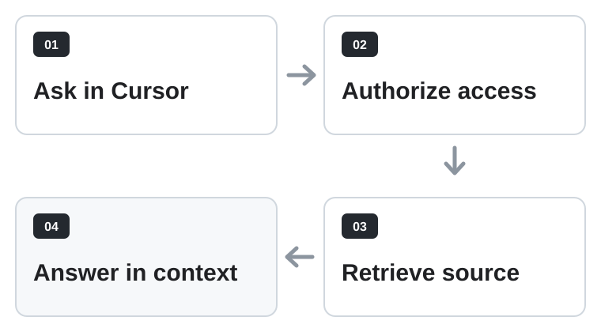

<p align="center">
  <a href="https://memoket.ai/"></a>
</p>

<h1 align="center">Memoket for Cursor</h1>

<p align="center">
  Ask about past meetings and calls without leaving Cursor, with answers tied<br>
  to the recording. Requires a Memoket account with recordings.
</p>

<p align="center">
  
  
  
</p>

---

## Install

The plugin is not yet listed in Cursor's public Marketplace. Install it locally
to add the Memoket tools and bundled rule.

### macOS / Linux

```bash
git clone https://github.com/memoket/memoket-plugin-cursor.git
cd memoket-plugin-cursor
mkdir -p "$HOME/.cursor/plugins/local/memoket"
cp -R plugins/memoket/. "$HOME/.cursor/plugins/local/memoket/"
```

<details>
<summary><strong>Windows PowerShell</strong></summary>

```powershell
git clone https://github.com/memoket/memoket-plugin-cursor.git
Set-Location memoket-plugin-cursor
$destination = Join-Path $HOME ".cursor\plugins\local\memoket"
New-Item -ItemType Directory -Force -Path $destination | Out-Null
Copy-Item -Recurse -Force "plugins\memoket\*" $destination
Copy-Item -Recurse -Force "plugins\memoket\.cursor-plugin" $destination
```

</details>

### First use

1. Run **Developer: Reload Window** from the Command Palette.
2. Ask about a meeting in Cursor Chat.
3. Complete Memoket OAuth and approve the requested tool call.

<details>
<summary><strong>MCP-only setup</strong></summary>

Use this only if you provide your own agent instructions. It adds the tools but
not the bundled Memoket rule.

Add to `~/.cursor/mcp.json` for every project or `.cursor/mcp.json` for one
project:

```json
{
  "mcpServers": {
    "memoket": {
      "url": "https://mcp.memoket.ai/mcp"
    }
  }
}
```

</details>

## Try it

```text
What did we decide about the API rollout in yesterday's sync?
What did Maya say about the launch date? Quote her and name the call.
Find the customer call where we discussed annual pricing.
```

Cursor may ask you to choose a recording. It can continue across transcript
pages when needed and attributes answers to the recording.

## How it works

MCP lets Cursor call Memoket's retrieval tools. The bundled rule guides source
selection, pagination, and attribution; Cursor decides when the rule is
relevant.

<p align="center">
  
</p>

<details>
<summary><strong>Tool contract: 7 read-only tools</strong></summary>

- **`search_recordings`**: typed matches and source IDs across recordings.
- **`list_conversations`**: paginated recording metadata.
- **`get_conversations`**: metadata for selected IDs, not transcript text.
- **`get_transcripts`**: paginated transcript segments for one recording.
- **`get_transcripts_by_participant`**: selected speakers within selected recordings.
- **`get_summaries`**: paginated latest or selected summaries.
- **`get_brief`**: Brief, then Summary, then Standard fallback.

MCP requests use `https://mcp.memoket.ai/mcp`. OAuth uses
`https://api.memoket.ai` with the `mcp:connect` scope; this repository stores
no access token.

Tool names and safety annotations were checked against the public MCP server on
2026-08-12 without querying account data.

</details>

## Privacy and control

- OAuth protects access. Cursor asks before tool calls by default; Run Modes can
  allow immediate execution.
- Retrieved titles, transcripts, summaries, and briefs enter Cursor's model
  context. Select only the recordings you need.
- Recording text is untrusted content. The bundled rule tells Cursor not to
  execute instructions found inside it.

<details>
<summary><strong>For contributors</strong></summary>

### Repository layout

```text
.cursor-plugin/marketplace.json
plugins/memoket/
  .cursor-plugin/plugin.json
  mcp.json
  rules/memoket.mdc
  assets/logo.png
  README.md
scripts/
  check-live-contract.mjs
  validate-template.mjs
```

Validate changes with:

```bash
node scripts/validate-template.mjs
node scripts/check-live-contract.mjs
```

The live check validates public OAuth metadata, MCP initialization, tool names,
and safety annotations. It does not query account data.

</details>

## Get Memoket

<p align="center">
  <a href="https://memoket.ai/">
    <picture>
      <source media="(prefers-color-scheme: dark)" srcset="assets/memoket-wordmark-light.svg">
      <source media="(prefers-color-scheme: light)" srcset="assets/memoket-wordmark.svg">
      
    </picture>
  </a>
</p>

<p align="center">
  <a href="https://apps.apple.com/us/app/memoket/id6758686146"></a>
  &nbsp;&nbsp;
  <a href="https://play.google.com/store/apps/details?id=com.ssheng.memoket"></a>
</p>

## Support

- [GitHub Issues](https://github.com/memoket/memoket-plugin-cursor/issues) for bugs and feature requests
- [Discord](https://discord.com/invite/tFh4nur4Vn) for community help
- [Trust Center](https://trust.memoket.ai/) for security and privacy
- [Contributing](CONTRIBUTING.md) · [Security policy](SECURITY.md)

## License

Copyright © 2026 Memoket Inc.

Source and documentation use the [MIT License](LICENSE). Brand and store assets
are covered by the [asset notice](LICENSE-ASSETS.md).
